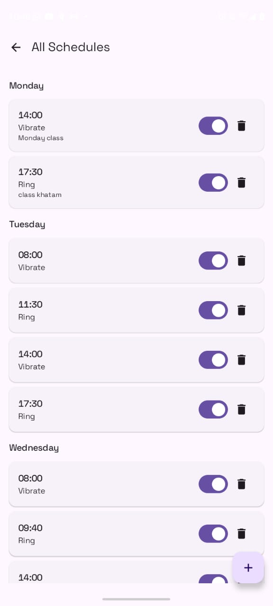
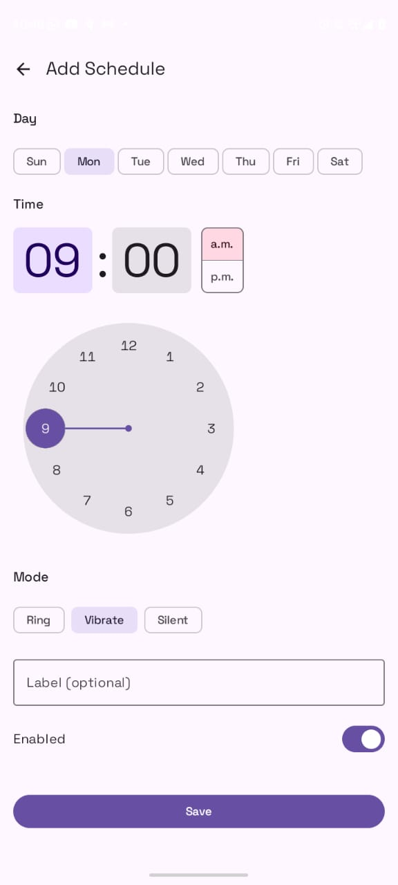
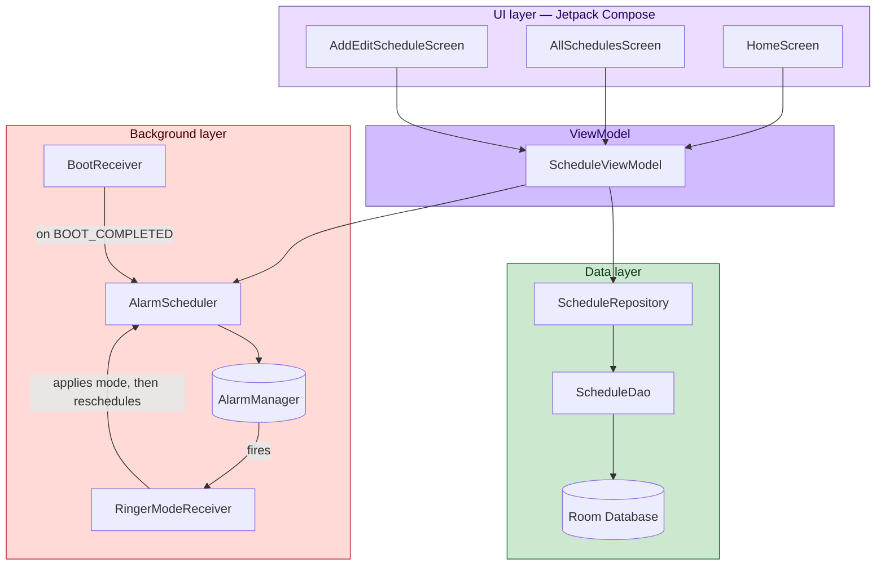

<div align="center">
  

  <h1>Ringly</h1>
  <p><i>Your phone's volume, on autopilot.</i></p>

  
  
  
  
  <br/>
  
  
  
</div>

<br/>

I got tired of manually flipping my phone between Ring, Vibrate, and Silent every single day — before class, before a meeting, at night, repeat. Ringly is the fix: you tell it your weekly schedule once, and it quietly handles the rest in the background, even after a reboot.

This is a solo, from-scratch Android project I've been building to actually learn the platform properly — not just the UI layer, but the messier stuff too: exact alarms that survive Doze mode, a database that doesn't leak state into the UI, and a background receiver chain that has to keep working even when the app itself is closed. It's an MVP right now, running end-to-end on my own phone, not yet published.

## Screenshots

<table>
<tr>
<td align="center"><br/><sub>Home</sub></td>
<td align="center"><br/><sub>All Schedules</sub></td>
<td align="center"><br/><sub>Add / Edit</sub></td>
</tr>
</table>


## What it actually does

- Set a day, time, and mode (Ring / Vibrate / Silent) — the schedule fires itself, every week, no repeat setup
- Home screen shows just today's triggers, so you're not digging through a full week to check what's next
- Full list view groups everything by day, with quick edit, delete, and enable/disable toggles
- Survives a reboot — a boot receiver quietly re-registers every alarm the OS wipes on restart
- Built entirely on Material 3, so it follows your system theme rather than fighting it

## How it's put together

Standard MVVM, with a repository sitting between Room and the UI so the ViewModel never talks to the database directly.



**The alarm chain, explained** — Android doesn't let you reliably set an exact *repeating* alarm anymore (`setExactRepeating` got downgraded for battery reasons years ago). So instead of fighting that, Ringly leans into one-shot alarms and just keeps re-arming itself:

1. `AlarmScheduler` works out the next time a given day+time will occur (today if it hasn't passed yet, otherwise next week) and sets one exact alarm for that moment.
2. When it fires, `RingerModeReceiver` changes the ringer mode — and in the same breath, asks `AlarmScheduler` to schedule the *next* occurrence, a week out.
3. Repeat forever. It's one alarm at a time, but the chain never breaks on its own.

**Why there's a boot receiver at all** — every alarm in `AlarmManager` gets wiped the moment your phone reboots. That's just how Android works, not a bug I introduced. `BootReceiver` listens for `BOOT_COMPLETED` and re-arms every enabled schedule pulled straight from Room, so a restart doesn't quietly break the whole app.

## Stack

| Layer | Choice |
|---|---|
| Language | Kotlin |
| UI | Jetpack Compose, Material 3 |
| Architecture | MVVM + Repository |
| Persistence | Room |
| Scheduling | `AlarmManager` (`setExactAndAllowWhileIdle`) |
| Background execution | `BroadcastReceiver` |
| Boot persistence | `BroadcastReceiver` on `BOOT_COMPLETED` |
| Navigation | Navigation Compose |
| Dependencies | Gradle Version Catalog (`libs.versions.toml`) |
| Annotation processing | KSP |
| Min / Target SDK | 29 / 36 |

## Project layout

```
com.arghadwip.ringly/
├── MainActivity.kt              # NavHost + DND permission gate
├── data/
│   ├── Schedule.kt              # Room entity + mode constants
│   ├── ScheduleDao.kt           # Room DAO — CRUD + Flow queries
│   ├── AppDatabase.kt           # Room database singleton
│   └── ScheduleRepository.kt    # Wraps the DAO, exposes Flow<List<Schedule>>
├── alarm/
│   ├── AlarmScheduler.kt        # Schedules/cancels alarms, works out next occurrence
│   ├── RingerModeReceiver.kt    # Fires on alarm, applies mode, re-arms itself
│   └── BootReceiver.kt          # Restores every alarm after a reboot
└── ui/
    ├── ScheduleViewModel.kt     # StateFlow + add/update/delete/toggle
    ├── HomeScreen.kt            # Today's schedule, quick add
    ├── AllSchedulesScreen.kt    # Full list, grouped by day
    └── AddEditScheduleScreen.kt # Day / time / mode form
```

## The data model

```kotlin
@Entity(tableName = "schedules")
data class Schedule(
    @PrimaryKey(autoGenerate = true) val id: Int = 0,
    val dayOfWeek: Int,      // Calendar constants: 1=Sunday ... 7=Saturday
    val hour: Int,           // 0–23
    val minute: Int,         // 0–59
    val mode: Int,           // 0=Ring, 1=Vibrate, 2=Silent
    val label: String = "",
    val enabled: Boolean = true
)
```

Each row is one independent trigger — not a linked time range. So "vibrate from 8:00 to 9:30" is currently two entries: `8:00 → Vibrate` and `9:30 → Ring`. It's a deliberate MVP shortcut, not an oversight — proper linked ranges are on the roadmap below.

## Permissions, and why each one exists

| Permission | Reason |
|---|---|
| `ACCESS_NOTIFICATION_POLICY` | Needed to change ringer mode at all — you'll be asked to grant Do Not Disturb access on first launch |
| `SCHEDULE_EXACT_ALARM` | Needed for the alarm to fire at the exact minute, without triggering Play Store's stricter `USE_EXACT_ALARM` review requirements |
| `RECEIVE_BOOT_COMPLETED` | Needed so schedules come back to life after your phone restarts |

One honest caveat: some phones (MIUI, ColorOS, Samsung, and similar heavily-customized Android skins) are aggressive about killing background alarms unless you manually whitelist the app. That's a real risk to Ringly's whole premise, and I haven't built an in-app fix for it yet — it's next on the list.

## What's next

**Coming up**
- Proper time ranges — linking a start and end trigger into one editable period instead of two loose entries
- A settings screen: theme toggle, battery-whitelist instructions, export/import
- Search and filtering on the full schedule list
- Better empty states and small transition animations

**Further out**
- Location-aware automation (silent at the office, ring at home)
- WiFi- and Bluetooth-triggered mode switching
- Auto-silence during calendar meetings
- One-time, non-recurring schedules
- A small stats screen — how often modes actually get switched
- Backup and restore

## Running it locally

\`\`\`bash
git clone https://github.com/arghadwip23/ringly.git
\`\`\`

Open it in Android Studio, let Gradle sync (dependencies come from the version catalog, so nothing extra to install), and run it on a device or emulator with API 29 or above. On first launch you'll be asked to grant Do Not Disturb access — without it, the app can't change your ringer mode, so don't skip that step.

<br/>

<div align="center">
<sub>Built by Arghadwip, mostly at hours when the phone really should've been on silent.</sub>
</div>